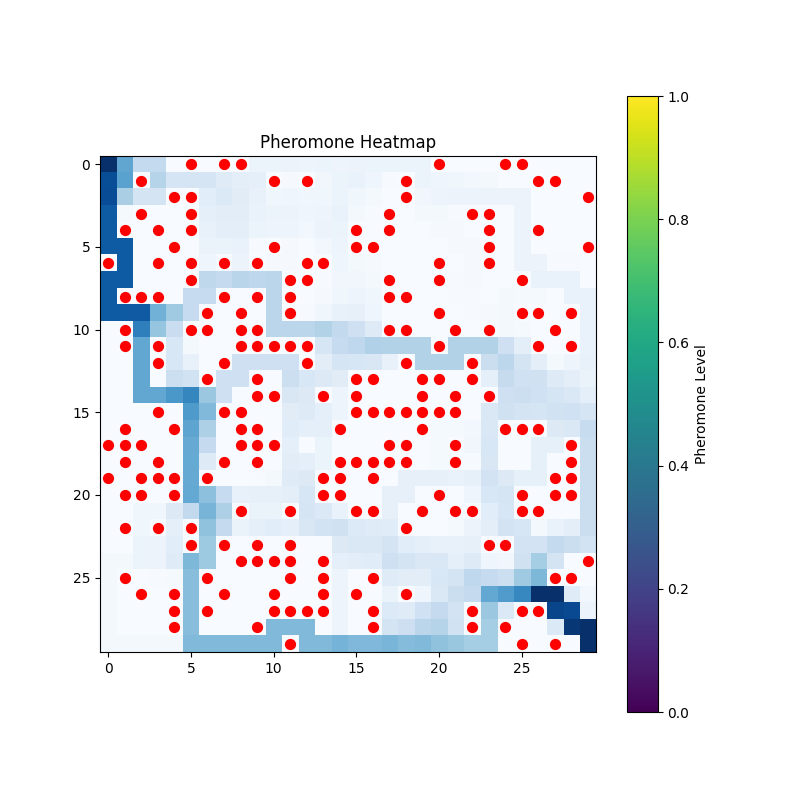
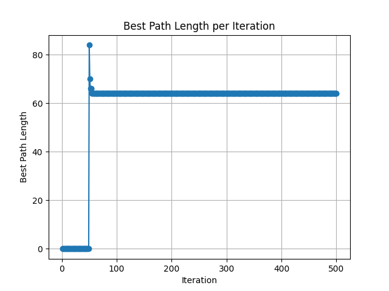
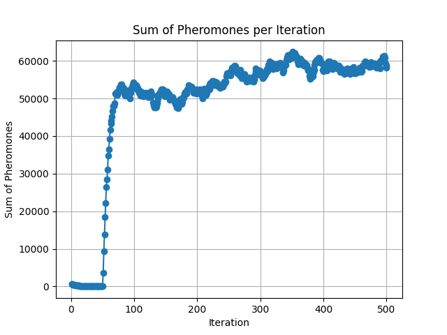

# Dynamic Ant Colony Optimization (ACO) Path Planning

This project implements a dynamic path planning system using the Ant Colony Optimization (ACO) metaheuristic algorithm. The simulation is built with **Python** and **Pygame** to visualize the pathfinding process in a grid-based environment with movable obstacles.

## ✨ Features

* **Dynamic Pathfinding:** The agent (robot) automatically detects new obstacles within a **7-cell range** and triggers an immediate ACO recalculation to find a new optimal path from its current position.
* **Real-time Visualization:** A graphical user interface (GUI) displays the grid ($30 \times 30$), obstacles, the agent's position, and the best-found path.
* **Customizable ACO Parameters:** Users can adjust key ACO parameters (Alpha, Beta, Rho, Q, Num. Ants, Iterations) through the GUI.
* **Statistical Analysis:** Generates plots for analyzing algorithm convergence, including **Best Path Length per Iteration** and **Pheromone Sum per Iteration**, along with a **Pheromone Heatmap**.

## ⚙️ ACO Parameters Used in Analysis

| Parameter | Code Name | Value | Description |
| :--- | :--- | :--- | :--- |
| Number of Ants | `NUM_ANTS` | 200 | Total number of agents searching for a path. |
| Evaporation Rate | `RHO` | 0.1 | Rate at which pheromones decay on the grid. |
| Pheromone Weight | `ALPHA` | 1.0 | Influence of existing pheromone trails on ant decision. |
| Heuristic Weight | `BETA` | 2.0 | Influence of desirability (inverse distance) on ant decision. |
| Pheromone Constant | `Q` | 100 | Amount of pheromone deposited per unit length of path. |

## 📊 Results and Analysis

The simulation successfully found an optimal path (e.g., **62 steps**) in a densely populated grid ($30 \times 30$). The generated statistics confirm rapid convergence of the algorithm.

### 1. Pheromone Heatmap

The heatmap visually demonstrates the concentration of pheromones after 500 iterations. Darker areas indicate higher pheromone levels, clearly outlining the final optimal path chosen by the colony.

### 2. Convergence Rate (Best Path Length)

The plot shows the algorithm quickly stabilized, locating the shortest path (approx. 64-65 steps) early in the simulation, confirming effective exploration and exploitation.

### 3. Pheromone Sum Over Time

This plot tracks the total amount of pheromones across the grid, showing that the system reached a stable equilibrium after roughly 100 iterations, where pheromone deposit balanced evaporation.

